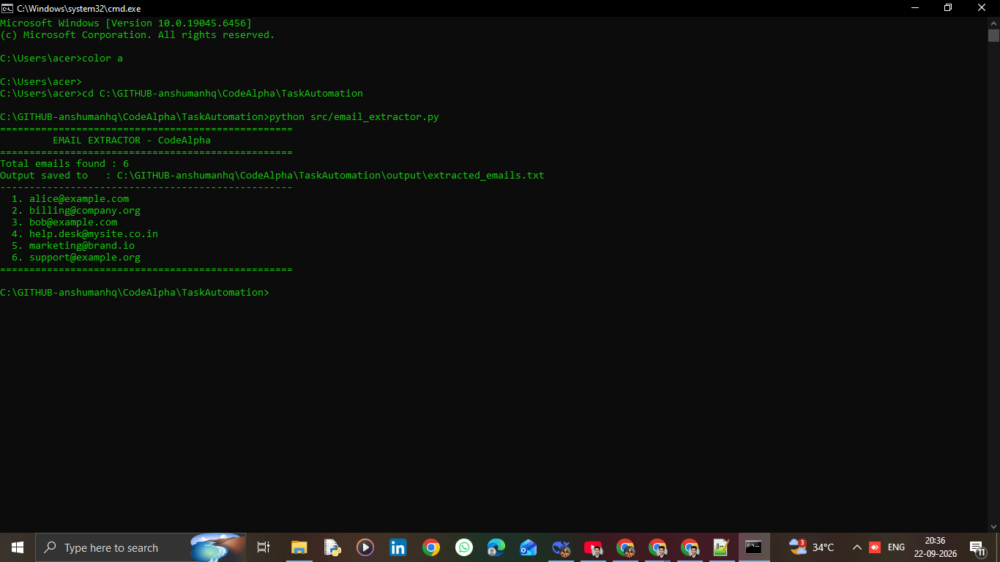

# 📧 CodeAlpha Task Automation — Email Extractor

A Python automation script that extracts all valid email addresses from a text file and saves them to an output file. Built as part of the **CodeAlpha Python Development Internship** (Task 3: Task Automation).

---

## 🚀 Features

- Extracts valid emails using regex
- Removes duplicates automatically
- Sorts emails alphabetically
- Clean modular code (separation of I/O and logic)
- No external dependencies required
- Handles missing files gracefully

---

## 📁 Project Structure

```
CodeAlpha_TaskAutomation/
│
├── src/
│   └── email_extractor.py     # Main script
├── input/
│   └── sample_emails.txt      # Sample input (dummy data)
├── output/
│   └── extracted_emails.txt   # Generated output
├── screenshots/
│   └── demo.png
├── README.md
├── requirements.txt
├── .gitignore
└── LICENSE
```

---

## 🛠️ Requirements

- Python 3.8 or higher
- No external libraries needed

---

## ▶️ How to Run

1. **Clone the repository**
   ```bash
   git clone https://github.com/anshumanhq/CodeAlpha_TaskAutomation.git
   cd CodeAlpha_TaskAutomation
   ```

2. **Run the script**
   ```bash
   python src/email_extractor.py
   ```

3. **Check the output**
   Open `output/extracted_emails.txt` to see the extracted emails.

---

## 🧪 Example

**Input** (`input/sample_emails.txt`):
```
Contact: alice@example.com
Email: bob@example.com
Support: support@example.org
```

**Output** (`output/extracted_emails.txt`):
```
alice@example.com
bob@example.com
support@example.org
```

---

## 📸 Screenshot



---

## 🔐 Privacy Note

This repository uses **dummy emails only**. Never upload real/private email data to public repositories.

---

## 👨‍💻 Author

**Your Name**
- GitHub: [@anshumanhq](https://github.com/anshumanhq)
- LinkedIn: [Your Profile](https://linkedin.com/in/anshuman-singh-hq)

---

## 📜 License

This project is licensed under the MIT License — see the [LICENSE](LICENSE) file for details.

---

## 🙏 Acknowledgement

Thanks to **CodeAlpha** for the internship opportunity.